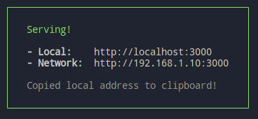

# QuickLux Greens

## This is a commercial Web App dedicated to help the user build their own Salad from scratch and have it delivered to their door! Here is a demo walkthrough its features and functinalities:

1. The first landing space is always the Homepage of the application that consists of only
   one "Order Salad" button in the middle
2. Upon clicking on it, the user gets navigated to the "Order Page" where tey could select from the provided vegies (Single vegetable could beselected a couple of times)
3. When you are ready, Click on the "Order" button and you will be redirected to the so called "Order Summary" section
4. This is the place one could observe their purchasing basket and fullfill a quick form required to have their order shiped successfully!
5. When done, one should click the corresponding button to finish this process
6. A modal dialog window gets showed representing your whole order summary.
7. Clicking "Close" brings you back to the Homepage
8. Have fun!

## Furthermore, there is another crucial application living in this project - The Admin Panel serving the Main App. Here is what one could do in it if they have the required credentials:

1. First thing that is loaded is a logging form
2. Validating your status, you will be redirected to the "Heart of that whole environment" - **the Lab**/**The Builder Stage**
3. This is a Playground where you could Create/Edit/Remove Salad Ingredients as much as you want
4. In order to have them really applied you have to click the "Save" button that would save them in their own dedicated file in the backend
5. Restart the Main QuickLux Greens App and the new Salad Ingredients would be visible
6. Voila, Enjoy!!!

## How to build and start the project

### Tech Stack used

NodeJS(16), React(18), Express(4)

### Prerequisites

The project was developed using Node 16 (You could use `nvm` to easily install and switch between different versions of `node`). Additionally, the `OS` used was `OpenSUSE 15.3` and there should be no problems with the installation process on other Linux distrubitions. Follow these steps to build and observe the application:

1. Download in a directory of your choosing using any of the following:

   - Over SSH:
     `git clone git@github.com:plamenpetkov8/QuickLux-Greens.git`
   - over HTTP:
     `git clone https://github.com/plamenpetkov8/QuickLux-Greens.git`

2. From the root of the project, navigate to **/app**:
   ```bash
   cd ./app
   ```
3. Install module's dependencies:
   ```bash
   npm install
   ```
4. Build the project:

   ```bash
   VITE_SERVER_PORT=<server_port> npm run build
   ```

   **Placeholders:**

   - **server_port**: The port of the server. Make sure you use the same port as the one used later initializing the server so that your api calls could be successful

   **NOTE:** The above command will produce a **./dist** folder

   **Example:**

   ```bash
   VITE_SERVER_PORT=7777 npm run build
   ```

5. Install a useful tool that would host our newly built app:
   ```bash
   npm install -g serve
   ```
6. Host our app:

   ```bash
   serve -p <host_port> -s dist
   ```

   **Placeholders:**

   - **host_port:** The port we are telling **`serve`** to serve our gui on locally

   **Example:**

   ```bash
   serve -p 3006 -s dist
   ```

7. In the terminal you could see a rectangle with a green border looking like this (if we use port 3000 otherwise it would be different):

   

8. Use any of the addresses provided later to view the App!
9. Open a new Terminal and navigate to the **root** of the project
10. Navigate to the **server** namespace:

    ```bash
    cd ./server
    ```

11. Install module's dependencies:
    ```bash
    npm install
    ```
12. Fire the server:

    ```bash
    PORT=<server_port> node index.mjs
    ```

    **Placeholders:**

    - **server_port:** The port the servevr will be listening on.  
      **NOTE:** It must be the same as App's one used for http calls

    **Example:**

    ```bash
    PORT=7777 node index.mjs
    ```

13. Open a new Terminal and navigate to the **root** of the project
14. Navigate to the **admin-panel** namespace:

    ```bash
    cd ./admin-panel
    ```

15. Install module's dependencies:
    ```bash
    npm install
    ```
16. Build the project:

    ```bash
    VITE_SERVER_PORT=<server_port> npm run build
    ```

    **Placeholders:**

    - **server_port**: The port of the server. Make sure you use the same port as the one we just used initializing the server so that your api calls could be successful

    **NOTE:** The above command will produce a **./dist** folder

    **Example:**

    ```bash
    VITE_SERVER_PORT=7777 npm run build
    ```

17. Install a useful tool that would host our newly built app:
    ```bash
    npm install -g serve
    ```
18. Host our app:

    ```bash
    serve -p <host_port> -s dist
    ```

    **Placeholders:**

    - **host_port:** The port we are telling **`serve`** to serve our gui on locally

    **Example:**

    ```bash
    serve -p 3007 -s dist
    ```

19. In the terminal you could see the same rectangle with the green border looking the one showed earlier
20. Use any of the addresses provided to view the App!
21. Enjoy and have fun!!!
